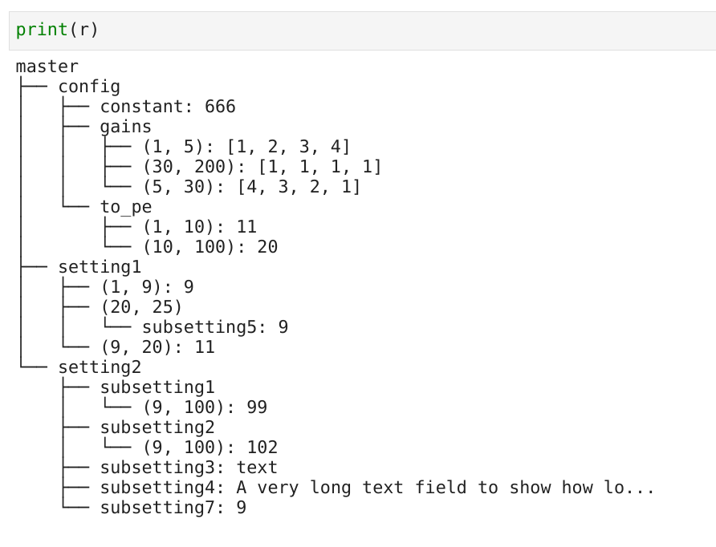
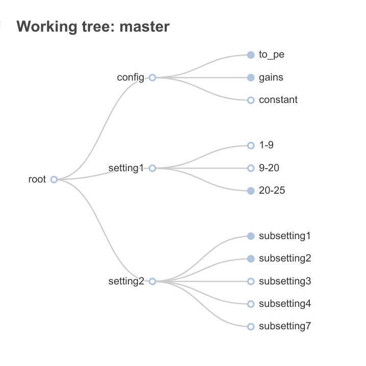
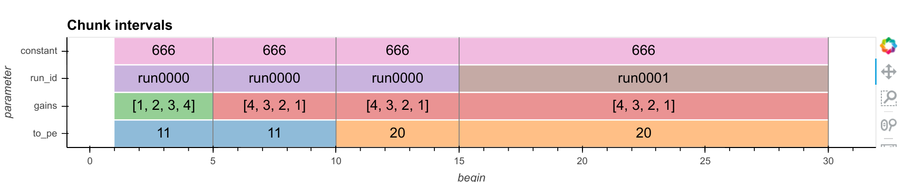
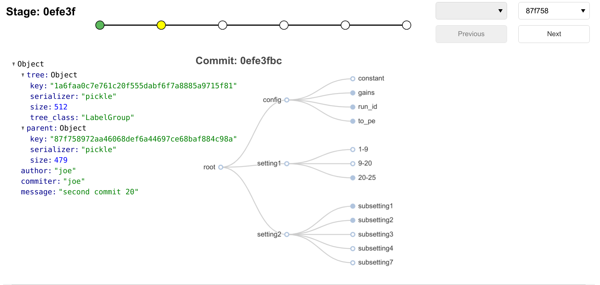

====
iGit
====

Git-like interval versioning.

**EXPERIMENTAL** Use at your own risk.

.. image:: https://img.shields.io/pypi/v/igit.svg
        :target: https://pypi.python.org/pypi/igit

.. image:: https://img.shields.io/travis/jmosbacher/igit.svg
        :target: https://travis-ci.com/jmosbacher/igit

.. image:: https://readthedocs.org/projects/igit/badge/?version=latest
        :target: https://igit.readthedocs.io/en/latest/?badge=latest
        :alt: Documentation Status

Git-like version control of data that is organized using interval trees as well as the simple string->value trees used in file systems.

Analogies to git:

=========== =============
**git**         **igit**
----------- -------------
blob        blob
filename    interval
tree/folder interval-tree
=========== =============

in iGit the structure being versioned is a hiearchy of trees and blobs like git, only instead of just 
supporting folder-like trees (string->value mapping) iGit supports interval trees as well.
An interval tree maps intervals to data, data can contain a python object (analog of a file) or
another tree (analog of a folder). This kind of structure is useful e.g. when tracking chunks of large arrays of data or 
configuration parameters that have defined intervals of validity attached to them. In these cases its useful
to be able to associate a unique piece of data with an interval between two integers (e.g. array indices or timestamps)
instead of a string of characters like a filename.

Example in short
----------------
.. code-block:: python
   
   # init repo, If you pass a valid fsspec uri, the matching filesystem protocol will be used 
   # and mapped to a python string-->bytes mapping. You can also pass in a python Mapping object.
   r = igit.Repo.init("file://./igit_test")

   # add some data
   c = r.new_config_group("config")
   to_pe = c.new_interval_group("to_pe")
   to_pe[1,10] = 11
   to_pe[10,100] = 20
   gains = c.new_interval_group("gains")
   gains[1,10] = [1,2,3,4]
   gains[5,30] = [4,3,2,1]
   gains[30,200] = [1,1,1,1]

   run_id = c.new_interval_group("run_id")
   times = range(0,200, 15)
   for i, period in enumerate(zip(times[:-1], times[1:])):
      run_id[period] = f"run{i:04}"

   r.new_interval_group("setting1")
   r.new_label_group("setting2")
   r.setting2.new_interval_group("subsetting1")
   r.setting2.new_interval_group("subsetting2")
   r.setting1[1,10] = 9
   r.setting1[9,20] = 11
   r.setting1.new_label_group((20,25))
   r.setting2.subsetting1[9,100] = 99
   r.setting2.subsetting2[9,100] = 102
   r.setting1[(20,25)]["subsetting5"] = 9
   r.setting2["subsetting3"] = "text"
   r.setting2["subsetting4"] = "A very long text field to show how long values are cut short in the tree view"

   # Stage and commit
   r.igit.add()
   r.igit.commit(f"commit {random.randint(1,10)}")

   # make some changes
   r.setting2["subsetting7"] = 9

   #stage and commit again
   r.igit.add()
   r.igit.commit(f"second commit {random.randint(20,30)}")

The repo has a string repr that shows the current working tree:

There are also some nice visualizations of the working tree built in:   

.. code-block:: python

   r.echarts_tree()

And of course it wouldnt be git if you cant poke around the commit history

.. code-block:: python

   r.browse_history()

      

   

* Free software: Apache-2.0
* Documentation: https://igit.readthedocs.io.

Features
--------

* IntervalGroup tree for intervaltree based "folders"
* LabelGroup tree for dict-like "folders"
* ConfigGroup for tracking interval of validity configuration objects
* Visualization tools
* Config "interval_chunking", splits your config into intervals of constant parameter values (for a subset of parameters or all)

Future Improvements
-------------------
* Option to add custom tree classes via plugins
* Option to add custom encoding (hashing/serialization/compression) classes via plugins
* Merge strategies

Credits
-------
This package relies on the intervaltree_ package for all interval tree manipulation

This package was created with Cookiecutter_ and the `briggySmalls/cookiecutter-pypackage`_ project template.

.. _intervaltree: https://github.com/chaimleib/intervaltree
.. _Cookiecutter: https://github.com/audreyr/cookiecutter
.. _`briggySmalls/cookiecutter-pypackage`: https://github.com/briggySmalls/cookiecutter-pypackage
