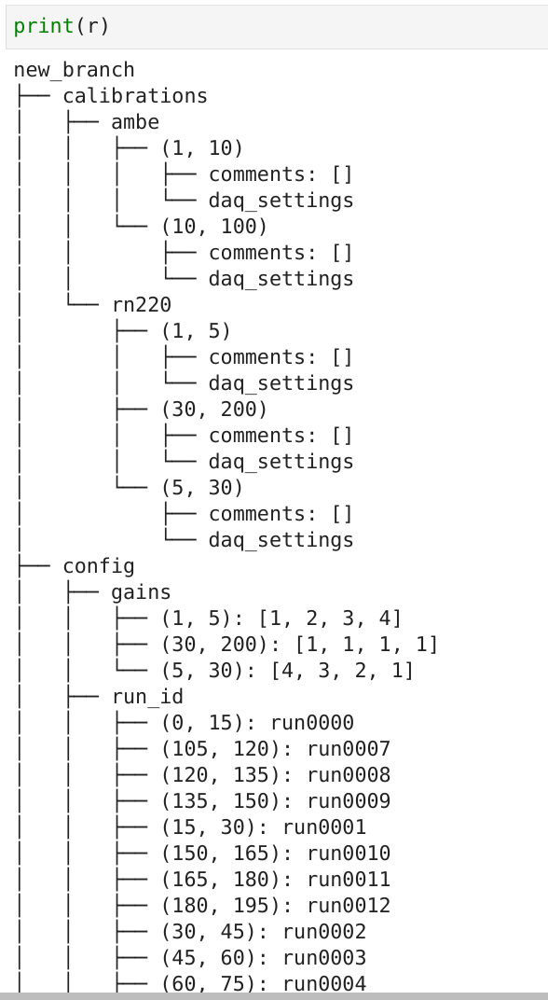

====
iGit
====

Git-like interval versioning.

**EXPERIMENTAL** Use at your own risk.

.. image:: https://img.shields.io/pypi/v/igit.svg
        :target: https://pypi.python.org/pypi/igit

.. image:: https://img.shields.io/travis/jmosbacher/igit.svg
        :target: https://travis-ci.com/jmosbacher/igit

.. image:: https://readthedocs.org/projects/igit/badge/?version=latest
        :target: https://igit.readthedocs.io/en/latest/?badge=latest
        :alt: Documentation Status

Git-like version control of data that is organized using interval trees as well as the simple string->value trees used in file systems.

Analogies to git:

=========== =============
**git**         **igit**
----------- -------------
blob        blob
filename    interval
tree/folder interval-tree
=========== =============

Git is great for source code
----------------------------
Git is not so great for the objects the code creates and the configuration parameters the code consumes.
  
**The objects the code creates (usually serialized and saved to binary files)**
Git tracks hierchies of folders and text content. Technically it can track binary data but it has no way of identifying which part of the object the binary file represents has changed and which is the same so it will save the entire file for even the smallest change, this defeats the purpose of the git object store and the repository quickly becomes massive.

**The configuration parameters the code consumes**
Git is meant to track changes over time in a distributed manner but at any time there is only one working tree. 
Configuration values can have time dependence, and a change to the value relavent to a specific time interval should not
cause a merge conflict with an edit of a different time interval. Git will easily merge two changes made to different
files but there is no way of defining the interval of validity for a file change.
    
**iGit is here to help**
iGit supports interval trees as first class citizens.Interval could be intervals of time or intervals 
of array indices or anything else you can think of. The concept of a filename is generalized to an interval,
so changes to two different intervals in iGit is equivalent to changing two different files in git. 
This allows for easy merging of changes being done on different intervals. e.g. two people working on the ideal 
parameters for processing two different datasets, taken e.g. at different times. Both analysts want to use the same 
algorithms and code but just tune the parameters to different values and then merge the results together for a combined 
configuration used by the entire collaboration. But they also want to version their configurations. So do they make two
config files and add them to a repository? what if they later on discover that the data actually should be split in three
parts with three configs? git is simply not designed for this kind of data with validity intervals attached to them.

iGit is built from the ground up with these use cases in mind but reusing gits architecture and reimplementing it for 
arbitrary tree structures as well as python objects.

in iGit the structure being versioned is a hiearchy of trees and blobs like git, only instead of just 
supporting folder-like trees (string->value mapping) iGit supports interval trees as well.
An interval tree maps intervals to data, data can contain a python object (analog of a file) or
another tree (analog of a folder). This kind of structure is useful e.g. when tracking chunks of large arrays of data or 
configuration parameters that have defined intervals of validity attached to them. In these cases its useful
to be able to associate a unique piece of data with an interval between two integers (e.g. array indices or timestamps)
instead of a string of characters like a filename.

Example usage
-------------
.. code-block:: python
   
   # init repo, If you pass a valid fsspec uri, the matching filesystem protocol will be used 
   # and mapped to a python string-->bytes mapping. You can also pass in a python Mapping object.
   r = igit.Repo.init("file://./igit_test")

   # add some data
   c = r.new_config_group("config")
   to_pe = c.new_interval_group("to_pe")
   to_pe[1,10] = 11
   to_pe[10,100] = 20
   gains = c.new_interval_group("gains")
   gains[1,10] = [1,2,3,4]
   gains[5,30] = [4,3,2,1]
   gains[30,200] = [1,1,1,1]

   run_id = c.new_interval_group("run_id")
   times = range(0,200, 15)
   for i, period in enumerate(zip(times[:-1], times[1:])):
      run_id[period] = f"run{i:04}"

   r.new_interval_group("setting1")
   r.new_label_group("setting2")
   r.setting2.new_interval_group("subsetting1")
   r.setting2.new_interval_group("subsetting2")
   r.setting1[1,10] = 9
   r.setting1[9,20] = 11
   r.setting1.new_label_group((20,25))
   r.setting2.subsetting1[9,100] = 99
   r.setting2.subsetting2[9,100] = 102
   r.setting1[(20,25)]["subsetting5"] = 9
   r.setting2["subsetting3"] = "text"
   r.setting2["subsetting4"] = "A very long text field to show how long values are cut short in the tree view"

   # Stage and commit
   r.igit.add()
   r.igit.commit(f"commit {random.randint(1,10)}")

   # make some changes
   r.setting2["subsetting7"] = 9

   #stage and commit again
   r.igit.add()
   r.igit.commit(f"second commit {random.randint(20,30)}")

The repo has a string repr that shows the current working tree:

There are also some nice visualizations of the working tree built in:   

.. code-block:: python

   r.echarts_tree()

.. image:: docs/assets/images/echarts_tree_view.png
   :alt: Tree echarts

The are utilities to help manage the interval based data, such as splitting on interval boundaries:

And of course it wouldnt be git if you cant poke around the commit history

.. code-block:: python

   r.browse_history()

.. image:: docs/assets/images/history_viewer.png
   :alt: History (commit) viewer

Interval indexing, who needs it?
================================
Exteremely useful for relating data with varying scales of resolution.

Example:
   - A pmt waveform sampled at 10ns resolution in non uniform intervals.
   - PMT gain measurement sampled at 0.5 week +- 1day resolution 
   - A processing algorithm that needs to correct the waveform by gain. eg corrected = counts/gain
   
The expression `corrected = counts/gain` is not well defined for `len(counts) != len(gain) != 1` algorithm needs to be fed both the counts and the gain for every sample.
   
**"Brute force" solution**
 
Feed the algorithm an "upsampled" array of the lower resolution measurement gain.
 
.. code-block:: python

   counts_array = [1,5,43,768,234,123,34,2345,345,23,342,36,46,4,6567,4,34]
   gain = [3,3,3,3,3,3,3,3,3,3,3,3,4,4,4,4,4,4,4,4,4,4,4,4,4]

This is obviously inefficient but is guarenteed to always work given enough resources.

**Alternative approach**
Batch the high resolution array into chunks of constant value of the low resolution array. Run the algorithm on each batch where gain is constant and therefore the operation `corrected = counts/gain` is well defined. Works well and very efficient.

But what happens when you have a third value with a completely different resolution? e.g. QE, now you need to take all of these scales into account when batching the high res array.

How can this be generalized to arbitrary resolutions? Interval indexing.

Most indexes define a one-to-one mapping from some label space to an offset for rapid lookup, an index can be used to "align" array binary operations on array of different length/different sorting. The interval index maps between continous intervals and indices, where the query is on overlap rather than equality.
The downside is that overlap queries can be very expensive using brute force methods, for efficient indexing on intervals, tree-like structures are needed, e.g the interval tree and nested containement list.

The O(logn+m) complexity of overlap queries allow for real time upsampling at varying resolution as well as splitting on intersection techniques to scale to large arrays.

**Further complications**
   - Many times some of the values can change over time and therefore need to be versioned for reproducability.
   - Some values are not values at all but rather algorithms/collections of values.

**Solution: meet igit**
A git-like version management system that supports interval trees as first class citizens as well as (almost) arbitrary python objects.

* Free software: Apache-2.0
* Documentation: https://igit.readthedocs.io.

Features
--------

* IntervalGroup tree for intervaltree based "folders"
* LabelGroup tree for dict-like "folders"
* ConfigGroup for tracking interval of validity configuration objects
* Visualization tools
* Config "interval_chunking", splits your config into intervals of constant parameter values (for a subset of parameters or all)
* Optional in-flight compression
* Optional in-flight encryption
* Supports remote/local file systems using fsspec 
  
Future Improvements
-------------------
* Option to add custom tree classes via plugins
* Option to add custom encoding (hashing/serialization/compression) classes via plugins
* Merge strategies

Credits
-------
This package relies on the intervaltree_ package for all interval tree manipulation

This package relies on the fsspec_ package for file system abstraction.

This package was created with Cookiecutter_ and the `briggySmalls/cookiecutter-pypackage`_ project template.

.. _intervaltree: https://github.com/chaimleib/intervaltree
.. _fsspec: https://github.com/intake/filesystem_spec/
.. _Cookiecutter: https://github.com/audreyr/cookiecutter
.. _`briggySmalls/cookiecutter-pypackage`: https://github.com/briggySmalls/cookiecutter-pypackage
